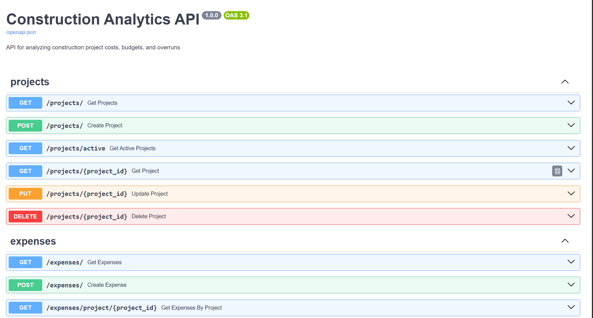

# 🏗️ Construction Analytics API

[](https://python.org)
[](https://fastapi.tiangolo.com)
[](https://railway.app)
[](https://anthropic.com)

A REST API for analyzing construction project costs, budgets, and overruns — with an AI-powered dashboard built on FastAPI, PostgreSQL, and the Claude API.

## 🚀 Live Demo

🌐 **https://web-production-de6e76.up.railway.app**

Visit `/dashboard` for the visual interface or `/docs` for the full Swagger UI.

## 📸 Screenshots

### Dashboard


### Project Detail


### AI Insights


### Swagger UI


## ✨ Features

- **Project Management** — Full CRUD with budget, status, and date tracking
- **Expense Tracking** — Log expenses by category with validation
- **Budget Analytics** — Real-time summary: budget, actuals, remaining, % used
- **Overrun Detection** — Automatic alerts with overrun amount and percentage
- **AI Insights** — Claude Haiku generates financial analysis per project
- **Excel Export** — Two-sheet export (Expenses + Summary) via Pandas
- **Interactive Dashboard** — Chart.js bar chart and donut chart
- **Rate Limiting** — SlowAPI middleware
- **CORS** — Configurable via environment variable

## 🛠️ Tech Stack

- **Python 3.12 + FastAPI 0.135**
- **SQLAlchemy 2.0 + PostgreSQL**
- **Pydantic v2** — input validation
- **Pandas 3.0 + openpyxl** — analytics and Excel export
- **Anthropic Claude Haiku** — AI insights
- **Jinja2 + Chart.js** — dashboard
- **SlowAPI** — rate limiting
- **Railway** — cloud deployment

## 📡 API Endpoints

**Projects** — `GET /projects/` · `POST /projects/` · `GET /projects/active` · `GET /projects/{id}` · `PUT /projects/{id}` · `DELETE /projects/{id}`

**Expenses** — `GET /expenses/` · `POST /expenses/` · `GET /expenses/{id}` · `GET /expenses/project/{id}` · `PUT /expenses/{id}` · `DELETE /expenses/{id}`

**Categories** — `GET /categories/` · `POST /categories/` · `GET /categories/{id}`

**Analytics** — `GET /analytics/projects/{id}/summary` · `GET /analytics/projects/{id}/breakdown` · `GET /analytics/projects/{id}/insights` · `GET /analytics/projects/{id}/export` · `GET /analytics/overruns`

## ⚙️ Setup
```bash
git clone https://github.com/moisesvivass/construction-analytics-api.git
cd construction-analytics-api
python -m venv venv
venv\Scripts\activate
pip install -r requirements.txt
```

Create `.env`:
```
DATABASE_URL=postgresql://postgres@localhost:5432/construction_analytics
ANTHROPIC_API_KEY=sk-ant-your-key-here
ALLOWED_ORIGINS=http://localhost:3000,http://127.0.0.1:8000
```

Run:
```bash
uvicorn app.main:app --reload
```

## 🔒 Security

- CORS with configurable origins via `ALLOWED_ORIGINS`
- SlowAPI rate limiting
- Pydantic v2 input validation
- API keys loaded from environment variables only
- `.env` excluded from version control

## ✅ Roadmap

- [x] Full CRUD — Projects, Expenses, Categories
- [x] Analytics with Pandas
- [x] AI Insights via Claude Haiku
- [x] Excel export
- [x] Interactive dashboard with Chart.js
- [x] Budget overrun detection
- [x] Deploy to Railway with PostgreSQL
- [ ] JWT Authentication
- [ ] Pagination
- [ ] Unit tests

## 👨‍💻 Author

**Moises Vivas** — CS graduate building backend systems in Python · Toronto, Canada

- GitHub: [github.com/moisesvivass](https://github.com/moisesvivass)