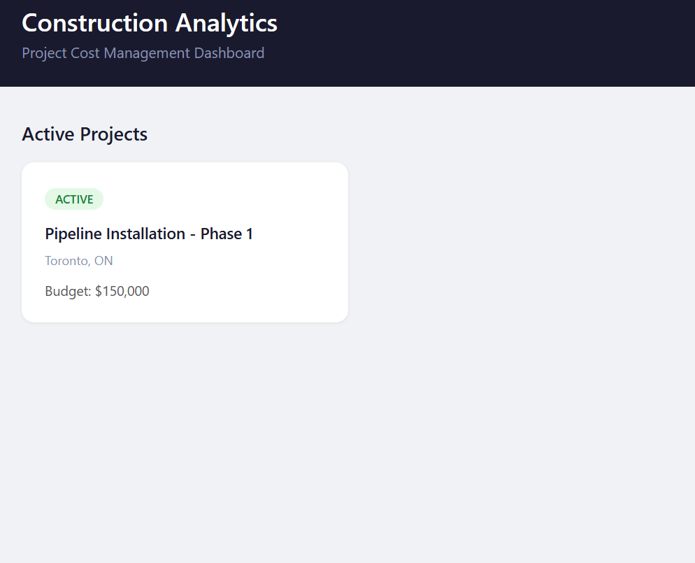
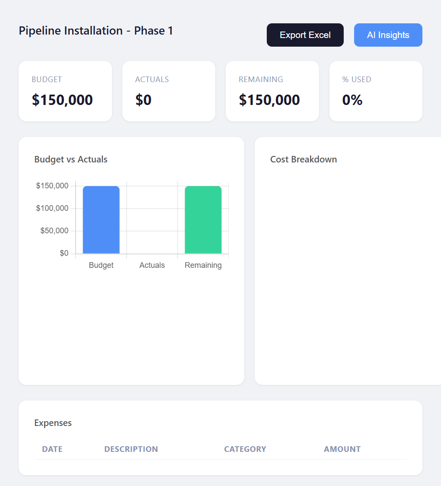
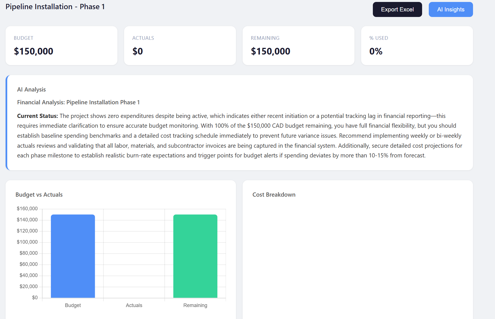

# 🏗️ Construction Analytics API

[](https://python.org)
[](https://fastapi.tiangolo.com)
[](https://railway.app)
[](https://anthropic.com)
[](LICENSE)

**The problem:** Construction companies collect cost data but rarely analyze it. Budget overruns get noticed at project close, not in time to act.

**What this solves:** A REST API that exposes real-time budget analytics and AI-generated financial insights, turning raw cost data into actionable decisions for project managers.

A production-ready REST API for analyzing construction project costs, budgets, and overruns — powered by FastAPI, PostgreSQL, and the Claude AI API. Built as a portfolio project to demonstrate real-world backend engineering in a domain-specific context.

## 🚀 Live Demo

| Interface | URL |
|---|---|
| 📊 Dashboard | [web-production-de6e76.up.railway.app/dashboard](https://web-production-de6e76.up.railway.app/dashboard) |
| 📄 API Docs (Swagger) | [web-production-de6e76.up.railway.app/docs](https://web-production-de6e76.up.railway.app/docs) |
| ❤️ Health Check | [web-production-de6e76.up.railway.app/health](https://web-production-de6e76.up.railway.app/health) |

## 📸 Screenshots

### Dashboard


### Project Detail


### AI Insights


### Swagger UI


## ✨ Features

- **Project Management** — Full CRUD with budget, status, location, and date tracking
- **Expense Tracking** — Log expenses by category with Pydantic v2 validation
- **Budget Analytics** — Real-time summary: total budget, actuals, remaining, % used
- **Overrun Detection** — Automatic alerts flagging overrun amount and percentage
- **AI Insights** — Claude Haiku generates per-project financial analysis in natural language
- **Excel Export** — Two-sheet workbook (Expenses + Summary) generated with Pandas + openpyxl
- **Interactive Dashboard** — Chart.js bar chart and donut chart, rendered via Jinja2 templates
- **Rate Limiting** — SlowAPI middleware protecting all endpoints
- **CORS** — Configurable origins via environment variable

## 🛠️ Tech Stack

| Layer | Technology |
|---|---|
| Language | Python 3.12 |
| Framework | FastAPI 0.135 |
| Database | PostgreSQL (Railway) |
| ORM | SQLAlchemy 2.0 |
| Validation | Pydantic v2 |
| Analytics | Pandas 3.0 + openpyxl |
| AI | Anthropic Claude Haiku |
| Frontend | Jinja2 + Chart.js |
| Rate Limiting | SlowAPI |
| Deployment | Railway |

## 📡 API Endpoints

### Projects
| Method | Endpoint | Description |
|---|---|---|
| `GET` | `/projects/` | List all projects |
| `POST` | `/projects/` | Create a project |
| `GET` | `/projects/active` | List active projects |
| `GET` | `/projects/{id}` | Get project by ID |
| `PUT` | `/projects/{id}` | Update project |
| `DELETE` | `/projects/{id}` | Delete project |

### Expenses
| Method | Endpoint | Description |
|---|---|---|
| `GET` | `/expenses/` | List all expenses |
| `POST` | `/expenses/` | Create an expense |
| `GET` | `/expenses/{id}` | Get expense by ID |
| `GET` | `/expenses/project/{id}` | Expenses by project |
| `PUT` | `/expenses/{id}` | Update expense |
| `DELETE` | `/expenses/{id}` | Delete expense |

### Categories
| Method | Endpoint | Description |
|---|---|---|
| `GET` | `/categories/` | List all categories |
| `POST` | `/categories/` | Create a category |
| `GET` | `/categories/{id}` | Get category by ID |

### Analytics
| Method | Endpoint | Description |
|---|---|---|
| `GET` | `/analytics/projects/{id}/summary` | Budget vs actuals summary |
| `GET` | `/analytics/projects/{id}/breakdown` | Expense breakdown by category |
| `GET` | `/analytics/projects/{id}/insights` | AI-generated financial analysis |
| `GET` | `/analytics/projects/{id}/export` | Download Excel report |
| `GET` | `/analytics/overruns` | List all projects over budget |

> **Note:** Fixed-path GET endpoints (e.g. `/projects/active`) are declared before parameterized routes (`/projects/{id}`) to avoid FastAPI routing conflicts — a key pattern when mixing static and dynamic paths.

## ⚙️ Local Setup
```bash
git clone https://github.com/moisesvivass/construction-analytics-api.git
cd construction-analytics-api
python -m venv venv
venv\Scripts\activate        # Windows
# source venv/bin/activate   # macOS/Linux
pip install -r requirements.txt
```

Create a `.env` file in the project root:
```env
DATABASE_URL=postgresql://postgres@localhost:5432/construction_analytics
ANTHROPIC_API_KEY=sk-ant-your-key-here
ALLOWED_ORIGINS=http://localhost:3000,http://127.0.0.1:8000
```

Run the development server:
```bash
uvicorn app.main:app --reload
```

Visit `http://127.0.0.1:8000/docs` to explore the API locally.

## 🔒 Security

- CORS configured with allowlist via `ALLOWED_ORIGINS` environment variable
- SlowAPI rate limiting on all endpoints
- Pydantic v2 input validation on all request bodies
- API keys loaded exclusively from environment variables
- `.env` excluded from version control via `.gitignore`
- Row-level data scoping — users only access their own records

## ✅ Roadmap

- [x] Full CRUD — Projects, Expenses, Categories
- [x] Budget analytics with Pandas
- [x] AI insights via Claude Haiku
- [x] Excel export (two-sheet workbook)
- [x] Interactive dashboard with Chart.js
- [x] Budget overrun detection
- [x] Rate limiting with SlowAPI
- [x] Deployed to Railway with PostgreSQL
- [ ] JWT Authentication
- [ ] Pagination on list endpoints
- [ ] Unit tests with pytest

## 👨‍💻 Author

**Moises Vivas** — Operations professional building data tools and web applications with Python and AI-assisted development · Toronto, Canada

- GitHub: [github.com/moisesvivass](https://github.com/moisesvivass)
